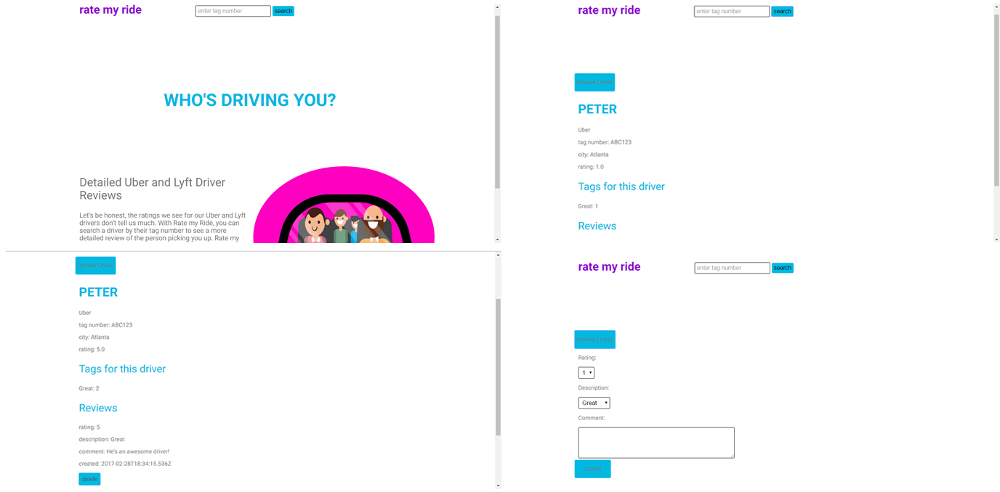

# Rate my Ride

## Summary

> [Rate my Ride](https://rate-my-ride.herokuapp.com/) is a community driven app that gives users the ability to find more descriptive reviews of their Uber or Lyft driver. It is intended to give the user more information about the driver that is coming to pick them up. The description categories include, driver rating, driver description and comments. This gives the user valuable information that can help them decide if the driver is right for them, before taking the ride.

## Getting Started

### Installing 

* git clone [https://github.com/allen30331/rate-my-ride](https://github.com/allen30331/rate-my-ride)

* cd rate-my-ride

* npm install

* Make sure you have [mongoDB](https://www.mongodb.com/) installed. You will need to have the local database running when you start the app. 

### Launching

* npm start
* open browser and go to [localhost:8080](localhost:8080)

### Testing 

* npm test

## How it Works

### Search for a driver

> After you order Uber or Lyft, search Rate my Ride using the driver's tag number. If the driver is found, you will see that driver's rating, descriptions and comments. If you're comfortable with what you see, take the ride, if not, cancel!

### Review a driver

> After your ride, review the driver. Leave your rating, description and comment for others to see.

### Add a driver

> If a driver isn't in the database you can easily add them. You enter the driver's name, company, tag number and city.

## Technology

### Front End

* HTML5
* CSS3
* Javascript
* jQuery

### Back End

* Node.js
* MongoDB
* Mocha
* Continuous integration and deployment with Travis CI

## Attributions 

### Images

* https://rydely.com/lyft-driver/

